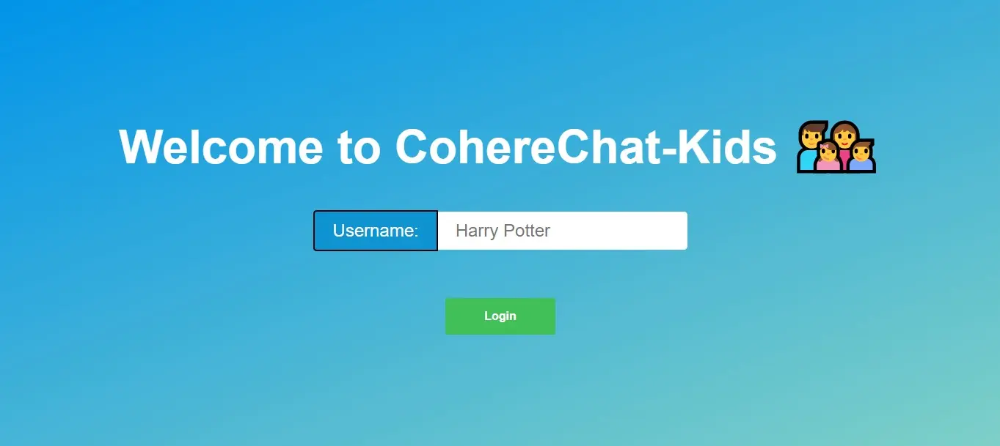
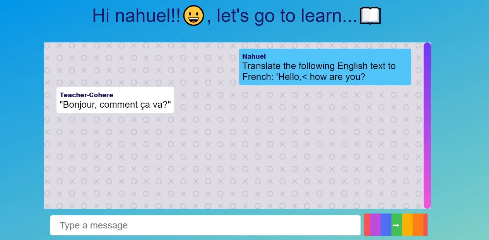

# chatGPT-Kids
Se desarrolla una aplicación de chat en tiempo real llamada "Cohere Kids" utilizando la API de Cohere. La aplicación permitirá a los niños de edad escolar participar en conversaciones y recibir respuestas generadas por un modelo de lenguaje entrenado.Para asegurarnos de que sea segura y adecuada para su uso por parte de los niños, se implementarán varias características y adaptaciones específicas.

## Características principales:

- **Interfaz de usuario atractiva y amigable para niños**, con colores brillantes, iconos divertidos y elementos interactivos diseñados para ser atractivos para este grupo de edad en dispositivos móviles y de escritorio.
Creación de prompts predefinidos: En lugar de permitir que los usuarios ingresen cualquier mensaje, proporcionaremos una serie de opciones predefinidas o frases clave que los niños puedan seleccionar. Estas opciones estarán relacionadas con temas educativos, preguntas de cultura general, actividades creativas, etc.
- **Validación de respuestas:** Las respuestas generadas por el modelo se someterán a una validación en el servidor para asegurarnos de que sean apropiadas para la edad escolar. Esto incluirá el filtrado de contenido inapropiado y el uso de una lista de palabras clave permitidas.
Uso de lenguaje sencillo y comprensible: Tanto las preguntas como los prompts utilizados estarán formulados de manera que sean fáciles de entender para los niños, evitando tecnicismos o lenguaje complejo.
Seguridad y autenticación: Se implementará un sistema simple de registro e inicio de sesión para los usuarios, garantizando la seguridad y privacidad de sus datos.
- **Almacenamiento de datos seguro:** Para almacenar la información de los usuarios y el historial de conversaciones de manera segura y protegida.
- **Tecnología utilizada:**

| Tecnología                                           | Objetivo                                            |
| ---------------------------------------------------- | --------------------------------------------------- |
| [Node.js](https://nodejs.org/)                       | Plataforma para ejecutar JavaScript en el servidor  |
| [React](https://es.react.dev/)                       | Para la interfaz de usuario                         |
| [Vite](https://vitejs.dev/)                          | Para la configuración rápida de la aplicación React |
| [React Router Dom](https://reactrouter.com/en/main)  | Para la navegación                                  |
| [axios](https://www.axios.com/)                      | Para realizar solicitudes HTTP                      |
| [Express](https://expressjs.com/)                    | Para la creación del servidor                       |
| [Socket.io](https://socket.io/)                      | Para la comunicación en tiempo real                 |
| [cohere-ai](https://www.cohere-ai.com/)              | Para generar respuestas basadas en prompts          |
| [dotenv](https://www.npmjs.com/package/dotenv)       | Para cargar las variables de entorno                |
| [Zustand](https://github.com/pmndrs/zustand)         | Para manejar el estado global                       |
| [Tailwind CSS](https://tailwindcss.com/)             | Para el estilizado de la interfaz de usuario        |

- **Estilizado:** Se empleará CSS module junto con [Tailwind](https://tailwindui.com/) para darle diseño a la interfaz de usuario.
___
- *Con "ChatGPT Kids", buscamos proporcionar a los niños una experiencia de chat segura y educativa, estimulando su creatividad e interacción en un entorno protegido y adecuado para su edad. Nuestra aplicación promoverá el aprendizaje y la diversión al mismo tiempo, facilitando conversaciones significativas y atractivas para los usuarios más jóvenes.*
___

## Condiciones:

- Poseer un mínimo de 2 vistas en la SPA.
- Implementar y utilizar como mínimo los hooks: useState, useEffect, useRef y useContext.
- Implementar y manejar un estado global con Zustand.
- Utilizar React Router Dom v6.14.
- Diseño responsive para mobile y desktop.
- Código limpio, formateado y documentado de ser necesario.
- Entrega dentro del límite de tiempo.

## Instalación y uso:

1. Clona el repositorio con: git clone git@github.com:canogerman/CohereGenerate-Kids.git
2. Debes crear una cuenta en https://cohere.com/ y automáticamente obtendrás una apiKey que puedes consultar en https://dashboard.cohere.ai/api-keys
3. Navega a la carpeta server del proyecto y tipea: "cp .env.example .env"
4. Copia tu APIKey creada y pégala en el archivo .env
5. Por último debes tener instalado node.js e instalar las dependencias con "npm install" y correr la app con "npm run dev"

## Vistas:

| Vista de login y chat                            |
| ------------------------------------------------ |
| |
|   |# CohereGenerate-Kids
